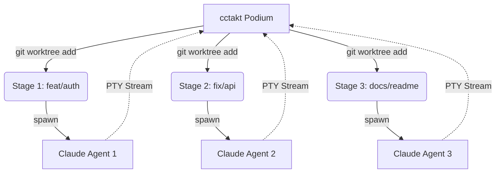

# cctakt (シーシー・タクト) 🎵

**Multi-agent Orchestrator for Claude Code powered by Git Worktree.**

`cctakt` は、複数の Claude Code エージェントを指揮（Orchestrate）し、並列でコーディングタスクを完遂させるための Rust 製 TUI アプリケーションです。

## 🎻 Concept: The Orchestration

一人の天才にすべてを任せるのではなく、複数の専門家（エージェント）にそれぞれの舞台（Worktree）を与え、指揮者がそれらを一つの交響曲（プロダクト）にまとめ上げる。

* **Podium (The TUI):** あなたが立つ指揮台。全エージェントの進捗を俯瞰し、指示を送ります。
* **Musicians (Agents):** 独立して動く Claude Code プロセス。
* **Stages (Worktrees):** 各エージェントに割り当てられた隔離済みの作業ディレクトリ。

## ✨ Key Features

* **Parallel Performance:** Git Worktree を活用し、メインの作業領域を汚さずに複数のタスク（バグ修正、機能追加、リファクタリング）を同時並行で実行。
* **Takt Control:** TUI 上から各エージェントの PTY（擬似端末）にリアルタイムアクセス。必要に応じて直接「指揮棒」を振り、軌道修正が可能。
* **Auto-Cleanup:** 演奏（タスク）が終了すれば、成果をマージし、舞台（Worktree）を自動的に撤収。
* **Native Speed:** Rust 製の軽量・高速なバイナリ。

## 🛠 Architecture



## 🚀 Quick Start (Coming Soon)

```bash
# 指揮を開始する
cctakt

```

1. `A` キーで新しいエージェントを追加。
2. 指示を出す（例: "APIのバリデーションを追加して"）。
3. エージェントが個別の Worktree で作業を開始。
4. 完了した作業をレビューし、メインブランチへマージ。

## 🏗 Tech Stack

* **Language:** Rust
* **TUI:** [ratatui](https://github.com/ratatui-org/ratatui)
* **Terminal:** [portable-pty](https://www.google.com/search?q=https://github.com/wez/wezterm/tree/main/portable-pty)
* **Runtime:** [tokio](https://github.com/tokio-rs/tokio)

---

## 📅 Roadmap

* [ ] Git Worktree の自動ライフサイクル管理の実装
* [ ] portable-pty によるマルチ・エージェント・ストリーミング
* [ ] Ratatui による指揮台 UI の構築
* [ ] GitHub Issues との連携機能

