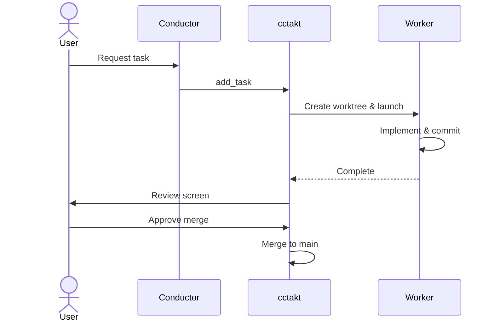

# cctakt

A TUI orchestrator for managing multiple Claude Code agents in parallel using Git Worktree


cctakt is a Rust-based TUI application that manages multiple Claude Code agents via Git Worktree and executes coding tasks in parallel.

## Features

- **Parallel Execution**: Leverage Git Worktree to run multiple tasks simultaneously
- **Conductor Mode**: Launch Claude Code as a "conductor" in the main repository to orchestrate workers via plan.json
- **Worker Management**: Monitor and interact with each worker's PTY output in real-time
- **Auto Review**: Display diffs when workers complete and support merge decisions
- **GitHub Issues Integration**: Auto-generate workers from issues with suggested branch names
- **Plan Feature**: Structured task management via `.cctakt/plan.json`
- **Themes**: 6 color themes (Cyberpunk, Monokai, Dracula, Nord, Arctic Aurora, Minimal)

## Requirements

- Rust 2024 Edition
- [Claude Code CLI](https://docs.anthropic.com/en/docs/claude-code) installed
- Git

## Installation

```bash
cargo install cctakt
```

### Building from Source

```bash
git clone https://github.com/taiki3/cctakt.git
cd cctakt
cargo install --path .
```

## Usage

### Quick Start

```bash
cctakt init   # Initial setup
cctakt        # Launch TUI
```

### Workflow



### 1. Give Instructions to the Conductor

Give tasks to the conductor Claude Code in the left pane using natural language:

```
Implement authentication. Create login and logout API endpoints.
```

The conductor uses the MCP tool `add_task` to create workers.

### 2. Workers Implement

Workers appear in the right pane and automatically start implementation.
- Work in dedicated Git Worktree (keeps main clean)
- Auto-commit on completion

### 3. Review & Merge

After a worker completes, a review screen with diff is displayed:
- `j/k` to scroll
- `Enter` or `m` to approve merge
- `q` to cancel

A build check runs automatically after merge.

## Key Bindings

### Global

| Key | Description |
|-----|-------------|
| `Ctrl+Q` | Quit |
| `Ctrl+T` | Open theme picker |
| `Ctrl+I` / `F2` | Open issue picker |
| `Ctrl+W` | Close active agent |
| `Ctrl+N` | Next tab |
| `Ctrl+P` | Previous tab |
| `Ctrl+1-9` / `Alt+1-9` | Switch tab by number |

### Navigation Mode

| Key | Description |
|-----|-------------|
| `h` | Move to left pane (conductor) |
| `l` | Move to right pane (workers) |
| `j` | Next worker (in right pane) |
| `k` | Previous worker (in right pane) |
| `i` / `Enter` | Switch to input mode |

### Input Mode

| Key | Description |
|-----|-------------|
| `Esc` | Return to navigation mode |
| Any key | Send input to agent |

### Review Mode

| Key | Description |
|-----|-------------|
| `j` / `↓` | Scroll down |
| `k` / `↑` | Scroll up |
| `d` / `Ctrl+D` | Half page down |
| `u` / `Ctrl+U` | Half page up |
| `g` | Go to top |
| `G` | Go to bottom |
| `m` / `Enter` | Execute merge |
| `Esc` / `q` | Cancel review |

### Theme Picker

| Key | Description |
|-----|-------------|
| `j` / `↓` | Next theme |
| `k` / `↑` | Previous theme |
| `Enter` | Apply theme |
| `q` | Cancel |

## Conductor Mode and plan.json

cctakt supports "Conductor Mode". Launch Claude Code in the main repository and write plans to `.cctakt/plan.json`, and cctakt will automatically generate and manage workers.

### plan.json Structure

```json
{
  "version": 1,
  "created_at": 1700000000,
  "description": "Task description",
  "tasks": [
    {
      "id": "worker-1",
      "action": {
        "type": "create_worker",
        "branch": "feat/example",
        "task_description": "Detailed implementation requirements",
        "base_branch": "main"
      },
      "status": "pending"
    },
    {
      "id": "review-1",
      "action": {
        "type": "request_review",
        "branch": "feat/example",
        "after_task": "worker-1"
      },
      "status": "pending"
    }
  ]
}
```

### Supported Actions

| Type | Description | Required Fields | Optional |
|------|-------------|-----------------|----------|
| `create_worker` | Create worktree and launch worker agent | `branch`, `task_description` | `base_branch` |
| `create_pr` | Create pull request | `branch`, `title` | `body`, `base`, `draft` |
| `merge_branch` | Merge branch | `branch` | `target` |
| `cleanup_worktree` | Delete worktree | `worktree` | - |
| `run_command` | Execute command | `worktree`, `command` | - |
| `notify` | Display notification message | `message` | `level` (info/warning/error/success) |
| `request_review` | Start review mode | `branch` | `after_task` |

### Task Status

| Status | Description |
|--------|-------------|
| `pending` | Waiting to execute |
| `running` | In progress |
| `completed` | Completed |
| `failed` | Failed |
| `skipped` | Skipped |

### Task Results

A `result` field is set upon task completion:

```json
{
  "result": {
    "commits": ["abc1234 feat: add feature"],
    "pr_number": 42,
    "pr_url": "https://github.com/owner/repo/pull/42"
  }
}
```

## MCP Server Integration

cctakt also operates as a [Model Context Protocol (MCP)](https://modelcontextprotocol.io/) server, allowing the conductor Claude Code to manage tasks through cctakt instead of directly manipulating `plan.json`. This avoids file conflicts and race conditions.

### Setup

Running `cctakt init` automatically adds MCP server configuration to `.claude/settings.json`:

```json
{
  "mcpServers": {
    "cctakt": {
      "command": "/path/to/cctakt",
      "args": ["mcp"]
    }
  }
}
```

### Available Tools

| Tool | Description |
|------|-------------|
| `add_task` | Add a new worker task (auto-creates plan if none exists) |
| `list_tasks` | List all tasks in the current plan |
| `get_task` | Get details of a specific task |
| `get_plan_status` | Get overall plan status (task count, completion count, etc.) |

### add_task Parameters

| Parameter | Required | Description |
|-----------|----------|-------------|
| `id` | Yes | Unique task ID (e.g., `feat-login`, `fix-bug-123`) |
| `branch` | Yes | Git branch name (e.g., `feat/login`, `fix/bug-123`) |
| `description` | Yes | Detailed task description for the worker |
| `plan_description` | No | Plan description (used only when creating a new plan) |

### Usage from Conductor

The conductor Claude Code can add tasks using MCP tools as follows:

```
Using add_task:
- id: "impl-auth"
- branch: "feat/auth"
- description: "Implement login functionality..."
```

Once a task is added, cctakt automatically detects it and launches the worker.

## Configuration File

Place `.cctakt.toml` in the project root to customize settings. The `cctakt init` command generates a default configuration file.

```toml
# Worktree storage location (default: .worktrees)
worktree_dir = ".worktrees"

# Branch name prefix (default: cctakt)
branch_prefix = "cctakt"

# Color theme: cyberpunk, monokai, dracula, nord, arctic, minimal
# Default: cyberpunk
theme = "cyberpunk"

[github]
# Auto-fetch issues (default: false)
auto_fetch_issues = false
# Repository (owner/repo format)
repository = "owner/repo"
# Filter labels
labels = ["cctakt", "good first issue"]

[anthropic]
# Anthropic API key (can also be set via ANTHROPIC_API_KEY env var)
# api_key = "sk-ant-..."
# Model to use (default: claude-sonnet-4-20250514)
model = "claude-sonnet-4-20250514"
# Max tokens (default: 1024)
max_tokens = 1024
# Auto-generate PR description (default: true)
auto_generate_pr_description = true

[keybindings]
# Default values shown
new_agent = "ctrl+t"
close_agent = "ctrl+w"
next_tab = "tab"
prev_tab = "shift+tab"
quit = "ctrl+q"
```

All configuration options are optional. Default values are used for unspecified items.

## Tech Stack

| Category | Technology |
|----------|------------|
| Language | Rust (Edition 2024) |
| TUI | [ratatui](https://github.com/ratatui-org/ratatui) 0.29 |
| Terminal | [portable-pty](https://github.com/wez/wezterm/tree/main/pty) + [vt100](https://crates.io/crates/vt100) |
| CLI | [clap](https://github.com/clap-rs/clap) 4.x |
| HTTP | [ureq](https://github.com/algesten/ureq) (GitHub API / Anthropic API) |
| Config | [toml](https://crates.io/crates/toml) + [serde](https://serde.rs/) |
| Events | [crossterm](https://github.com/crossterm-rs/crossterm) |

## Architecture

```
cctakt (TUI)
├── Conductor Claude Code (main repository)
│   └── Writes plan to .cctakt/plan.json
│
└── Worker Claude Code (each worktree)
    └── Executes actual tasks
```

### Module Structure

| Module | Description |
|--------|-------------|
| `src/plan.rs` | Plan management (conductor ↔ cctakt communication) |
| `src/worktree.rs` | Git Worktree management |
| `src/agent.rs` | PTY agent management |
| `src/github.rs` | GitHub API (Issues, PR) |
| `src/anthropic.rs` | Anthropic API (PR description generation) |
| `src/mcp.rs` | MCP server (tool calls from conductor) |
| `src/theme.rs` | Color theme definitions |
| `src/config.rs` | Configuration file management |
| `src/tui/` | TUI rendering & input handling |

## License

GPL-3.0
