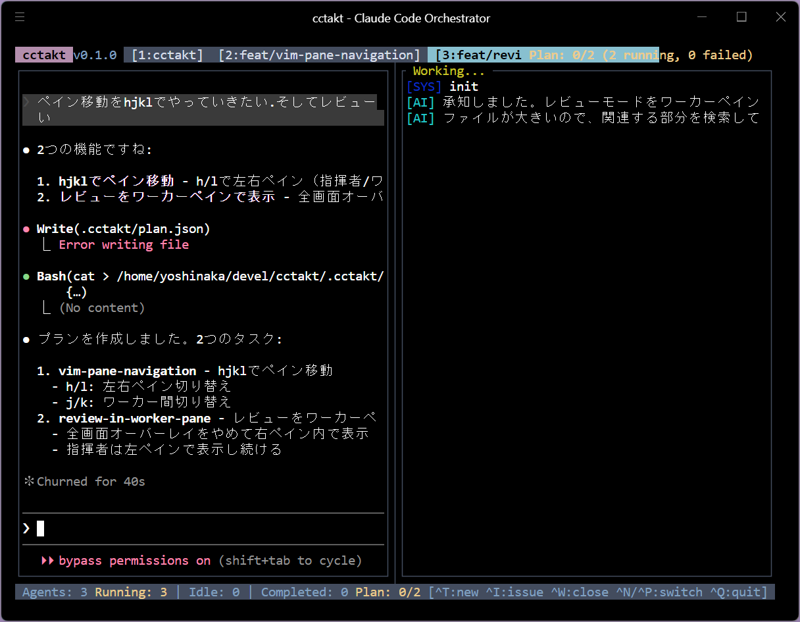

# cctakt (シーシー・タクト)

複数の Claude Code エージェントを Git Worktree で並列管理する TUI オーケストレーター



cctakt は、複数の Claude Code エージェントを Git Worktree で管理し、並列でコーディングタスクを実行するための Rust 製 TUI アプリケーションです。

## 特徴

- **並列実行**: Git Worktree を活用し、複数のタスクを同時並行で実行
- **指揮者モード**: メインリポジトリで Claude Code を「指揮者」として起動し、plan.json を通じてワーカーを統括
- **ワーカー管理**: 各ワーカーの PTY 出力をリアルタイムで確認・操作可能
- **自動レビュー**: ワーカー完了時に diff を表示し、マージ判断をサポート
- **GitHub Issues 連携**: Issue からワーカーを自動生成、ブランチ名を提案
- **プラン機能**: `.cctakt/plan.json` を通じた構造化タスク管理
- **テーマ**: 6種類のカラーテーマ（Cyberpunk, Monokai, Dracula, Nord, Arctic Aurora, Minimal）

## 必要条件

- Rust 2024 Edition
- [Claude Code CLI](https://docs.anthropic.com/en/docs/claude-code) がインストールされていること
- Git

## インストール

```bash
cargo install cctakt
```

### ソースからビルド

```bash
git clone https://github.com/taiki3/cctakt.git
cd cctakt
cargo install --path .
```

## 使い方

```bash
# TUI を起動（引数なし）
cctakt

# プロジェクトを初期化（.cctakt.toml を生成）
cctakt init

# 環境設定を確認
cctakt status

# GitHub Issues を一覧表示
cctakt issues

# GitHub Issues をラベルでフィルタ
cctakt issues --labels "bug,enhancement"

# プランを実行（CLI モード、TUI なし）
cctakt run .cctakt/plan.json
```

## キーバインド

### グローバル

| キー | 説明 |
|------|------|
| `Ctrl+Q` | 終了 |
| `Ctrl+T` | テーマピッカーを開く |
| `Ctrl+I` / `F2` | Issue ピッカーを開く |
| `Ctrl+W` | アクティブなエージェントを閉じる |
| `Ctrl+N` | 次のタブへ |
| `Ctrl+P` | 前のタブへ |
| `Ctrl+1-9` / `Alt+1-9` | タブを番号で切り替え |

### ナビゲーションモード

| キー | 説明 |
|------|------|
| `h` | 左ペインへ移動（指揮者） |
| `l` | 右ペインへ移動（ワーカー） |
| `j` | 次のワーカーへ（右ペイン時） |
| `k` | 前のワーカーへ（右ペイン時） |
| `i` / `Enter` | 入力モードへ切り替え |

### 入力モード

| キー | 説明 |
|------|------|
| `Esc` | ナビゲーションモードへ戻る |
| 任意のキー | エージェントへ入力を送信 |

### レビューモード

| キー | 説明 |
|------|------|
| `j` / `↓` | 下へスクロール |
| `k` / `↑` | 上へスクロール |
| `d` / `Ctrl+D` | 半ページ下へ |
| `u` / `Ctrl+U` | 半ページ上へ |
| `g` | 先頭へ |
| `G` | 末尾へ |
| `m` / `Enter` | マージを実行 |
| `Esc` / `q` | レビューをキャンセル |

### テーマピッカー

| キー | 説明 |
|------|------|
| `j` / `↓` | 次のテーマへ |
| `k` / `↑` | 前のテーマへ |
| `Enter` | テーマを適用 |
| `q` | キャンセル |

## 指揮者モードと plan.json

cctakt は「指揮者モード」をサポートしています。メインリポジトリで Claude Code を起動し、`.cctakt/plan.json` にプランを書き込むことで、cctakt がワーカーを自動的に生成・管理します。

### plan.json の構造

```json
{
  "version": 1,
  "created_at": 1700000000,
  "description": "タスクの説明",
  "tasks": [
    {
      "id": "worker-1",
      "action": {
        "type": "create_worker",
        "branch": "feat/example",
        "task_description": "実装内容の詳細",
        "base_branch": "main"
      },
      "status": "pending"
    },
    {
      "id": "review-1",
      "action": {
        "type": "request_review",
        "branch": "feat/example",
        "after_task": "worker-1"
      },
      "status": "pending"
    }
  ]
}
```

### サポートされるアクション

| タイプ | 説明 | 必須フィールド | オプション |
|--------|------|---------------|-----------|
| `create_worker` | Worktree を作成し、ワーカーエージェントを起動 | `branch`, `task_description` | `base_branch` |
| `create_pr` | プルリクエストを作成 | `branch`, `title` | `body`, `base`, `draft` |
| `merge_branch` | ブランチをマージ | `branch` | `target` |
| `cleanup_worktree` | Worktree を削除 | `worktree` | - |
| `run_command` | コマンドを実行 | `worktree`, `command` | - |
| `notify` | 通知メッセージを表示 | `message` | `level` (info/warning/error/success) |
| `request_review` | レビューモードを開始 | `branch` | `after_task` |

### タスクステータス

| ステータス | 説明 |
|-----------|------|
| `pending` | 実行待ち |
| `running` | 実行中 |
| `completed` | 完了 |
| `failed` | 失敗 |
| `skipped` | スキップ |

### タスク結果

タスク完了時には `result` フィールドが設定されます：

```json
{
  "result": {
    "commits": ["abc1234 feat: add feature"],
    "pr_number": 42,
    "pr_url": "https://github.com/owner/repo/pull/42"
  }
}
```

## MCP サーバー連携

cctakt は [Model Context Protocol (MCP)](https://modelcontextprotocol.io/) サーバーとしても動作し、指揮者 Claude Code が直接 `plan.json` を操作する代わりに、cctakt 経由でタスクを管理できます。これにより、ファイル競合やレースコンディションを回避できます。

### セットアップ

`cctakt init` を実行すると、`.claude/settings.json` に MCP サーバー設定が自動的に追加されます：

```json
{
  "mcpServers": {
    "cctakt": {
      "command": "/path/to/cctakt",
      "args": ["mcp"]
    }
  }
}
```

### 利用可能なツール

| ツール | 説明 |
|--------|------|
| `add_task` | 新しいワーカータスクを追加（プランがなければ自動作成） |
| `list_tasks` | 現在のプラン内の全タスクを一覧表示 |
| `get_task` | 特定タスクの詳細を取得 |
| `get_plan_status` | プラン全体のステータス（タスク数、完了数など）を取得 |

### add_task パラメータ

| パラメータ | 必須 | 説明 |
|-----------|------|------|
| `id` | ○ | ユニークなタスクID（例: `feat-login`, `fix-bug-123`） |
| `branch` | ○ | Git ブランチ名（例: `feat/login`, `fix/bug-123`） |
| `description` | ○ | ワーカーへの詳細なタスク説明 |
| `plan_description` | - | プラン全体の説明（新規プラン作成時のみ使用） |

### 指揮者からの使用例

指揮者 Claude Code は MCP ツールを使って以下のようにタスクを追加できます：

```
add_task を使用:
- id: "impl-auth"
- branch: "feat/auth"
- description: "ログイン機能を実装してください。..."
```

タスクが追加されると、cctakt が自動的に検知してワーカーを起動します。

## 設定ファイル

プロジェクトルートに `.cctakt.toml` を配置して設定をカスタマイズできます。`cctakt init` コマンドでデフォルト設定ファイルを生成できます。

```toml
# Worktree の保存先（デフォルト: .worktrees）
worktree_dir = ".worktrees"

# ブランチ名のプレフィックス（デフォルト: cctakt）
branch_prefix = "cctakt"

# カラーテーマ: cyberpunk, monokai, dracula, nord, arctic, minimal
# デフォルト: cyberpunk
theme = "cyberpunk"

[github]
# Issue を自動取得するか（デフォルト: false）
auto_fetch_issues = false
# リポジトリ（owner/repo 形式）
repository = "owner/repo"
# フィルタするラベル
labels = ["cctakt", "good first issue"]

[anthropic]
# Anthropic API キー（環境変数 ANTHROPIC_API_KEY でも設定可能）
# api_key = "sk-ant-..."
# 使用するモデル（デフォルト: claude-sonnet-4-20250514）
model = "claude-sonnet-4-20250514"
# 最大トークン数（デフォルト: 1024）
max_tokens = 1024
# PR 説明を自動生成するか（デフォルト: true）
auto_generate_pr_description = true

[keybindings]
# デフォルト値を記載
new_agent = "ctrl+t"
close_agent = "ctrl+w"
next_tab = "tab"
prev_tab = "shift+tab"
quit = "ctrl+q"
```

すべての設定項目はオプションです。指定しない項目はデフォルト値が使用されます。

## Tech Stack

| カテゴリ | 技術 |
|----------|------|
| 言語 | Rust (Edition 2024) |
| TUI | [ratatui](https://github.com/ratatui-org/ratatui) 0.29 |
| ターミナル | [portable-pty](https://github.com/wez/wezterm/tree/main/pty) + [vt100](https://crates.io/crates/vt100) |
| CLI | [clap](https://github.com/clap-rs/clap) 4.x |
| HTTP | [ureq](https://github.com/algesten/ureq) (GitHub API / Anthropic API) |
| 設定 | [toml](https://crates.io/crates/toml) + [serde](https://serde.rs/) |
| イベント | [crossterm](https://github.com/crossterm-rs/crossterm) |

## アーキテクチャ

```
cctakt (TUI)
├── 指揮者 Claude Code (メインリポジトリ)
│   └── .cctakt/plan.json にプラン書き込み
│
└── Worker Claude Code (各 Worktree)
    └── 実際のタスク実行
```

### モジュール構成

| モジュール | 説明 |
|-----------|------|
| `src/plan.rs` | プラン管理（指揮者 ↔ cctakt 通信） |
| `src/worktree.rs` | Git Worktree 管理 |
| `src/agent.rs` | PTY エージェント管理 |
| `src/github.rs` | GitHub API (Issues, PR) |
| `src/anthropic.rs` | Anthropic API（PR 本文生成） |
| `src/mcp.rs` | MCP サーバー（指揮者からのツール呼び出し） |
| `src/theme.rs` | カラーテーマ定義 |
| `src/config.rs` | 設定ファイル管理 |
| `src/tui/` | TUI レンダリング・入力処理 |

## ライセンス

GPL-3.0
